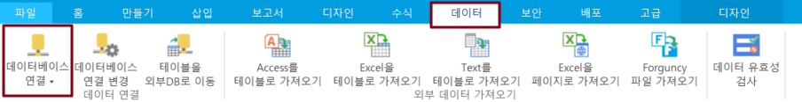
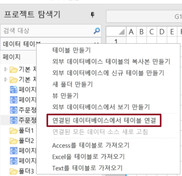
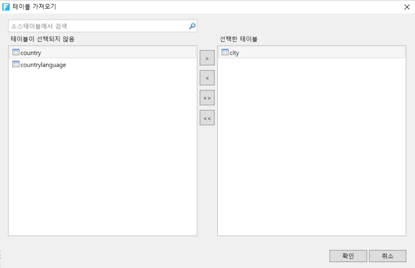
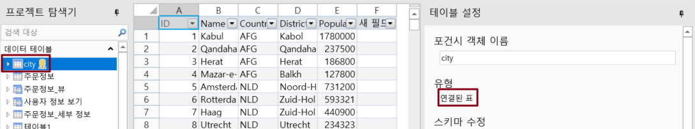
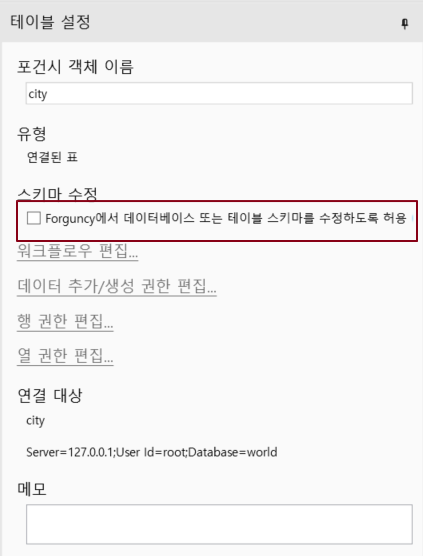
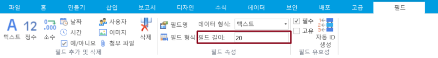

# Dameng 데이터베이스에 연결

Dameng 데이터베이스에 연결하는 방법에 대해 설명합니다.


* 외부 데이터베이스에 연결된 포간시가 제대로 작동하려면 대상 데이터 테이블에 비어 있지 않은 고유하고 비어 있지 않은 기본 키(적어도 하나)를 설정해야 합니다. 기본 키를 선택할 때 text, ntext, Binary, Varbinary, image, hierarchyid, xml, sql\_variant, geometry, geography의 데이터 유형 필드를 선택하지 마십시오.
* 연결된 데이터 테이블을 만들면 포간는 테이블의 기본 키를 가져오려고 시도하며 기본 키가 없는 경우 포간시는 비어 있지 않은 고유하고 비어 있지 않은 열을 기본 키로 찾습니다.


Dameng 데이터베이스에 연결하는 방법은 다음과 같습니다.

1. &#x20;리본 메뉴 모음에서 \[데이터]>\[데이터베이스 연결]을 선택합니다.

&#x20;     또는 테이블의 레이블 표시줄에서 마우스 오른쪽 버튼 클릭하고 연결된 데이터베이스에서 테이블에

&#x20;     연결을 선택합니다.

2. 데이터 소스를 \[Dameng 데이터베이스]로 선택합니다.
3. 서버 이름, 사용자 이름, 암호, 포트 번호를 입력한 후 데이터베이스를 선택합니다.
4. 설정이 완료되면 "연결 테스트"를 클릭하여 서버 연결을 테스트하고 설정할 수 있습니다.

&#x20;     \[확인]을 클릭합니다.

&#x20;5\. \[확인]을 클릭하면 \[테이블 가져오기] 대화 상자가 나타나고, 데이터 소스의 테이블 목록에서 가져올 테이블을 선택하고, \[>]를 클릭하여 선택한 테이블을 선택한 테이블 목록으로 이동하거나, \[>>]을 클릭하여 데이터 소스의 테이블을 선택한 테이블 목록으로 이동합니다.


* 대상 소스가 뷰인 경우 "(뷰)" 접미사가 추가됩니다.
* 보기는 데이터 권한 설정을 지원합니다.
* 뷰를 선택한 경우 \[확인]을 클릭한 후 뷰의 기본 키를 선택합니다.


6. &#x20;\[확인]을 클릭하여 테이블을 가져옵니다. 테이블을 열면 테이블 설정에서 해당 형식이 아웃리치 테이블인 것을 볼 수 있습니다.

Dameng에 연결한 후 데이터베이스에 연결 아래의 드롭다운 버튼 클릭하면 연결된 데이터베이스가 나열됩니다.&#x20;


* "Forguncy에 데이터베이스 또는 테이블 스키마를 수정하도 허용"을 선택하면 새 필드 추가, 필드 삭제, 필드 이름 수정, 필드 기본값/필수/고유 설정 등과 같은 아웃리치 데이터 테이블을 활자 그리드에서 직접 수정할 수 있습니다.
* 아웃리치 테이블에서 워크플로를 설정하거나 레코드 만들기 권한, 행 권한 및 필드 권한을 비롯한 데이터 권한을 설정해야 하는 경우 이 옵션을 선택해야 합니다.

&#x20;

* 포건시가 데이터베이스 또는 테이블 구조를 수정할 수 있도록 허용을 선택한 후 데이터 형식이 텍스트, 사용자, 그림 및 첨부 파일인 필드 길이를 설정할 수도 있습니다.   

* 포건시에서 아웃리치 테이블을 제거해도 아웃리치 데이터베이스의 데이터 테이블은 삭제되지 않습니다.



## Dameng 데이터베이스 필드 유형

포건시는 Dameng 필드 형식의 일부를 지원하며 지원되지 않는 필드 형식은 모두 텍스트 형식으로 변환됩니다.

Dameng의 필드 유형은 다음 표에 표시된 대로 포건시의 필드 유형에 해당합니다.

| CHAR                           | 텍스트입니다                           |
| ------------------------------ | -------------------------------- |
| CHARACTER                      | 텍스트이지만 저장 프로시저 매개 변수는 지원되지 않습니다. |
| VARCHAR                        | 텍스트입니다                           |
| VARCHAR2                       | 텍스트입니다                           |
| NUMERIC                        | 소수점                              |
| DECIMAL                        | 소수점                              |
| NUMBER                         | 소수점                              |
| DEC                            | 소수점                              |
| BIT                            | 아니요, 그렇지 않습니다                    |
| INTEGER                        | 정수입니다                            |
| INT                            | 정수입니다                            |
| BIGINT                         | 정수입니다                            |
| TINYINT                        | 정수, 값 0 \~ 127만 지원됩니다.           |
| BYTE                           | 정수입니다                            |
| SMALLINT                       | 정수입니다                            |
| BINARY                         | 아니요, 그렇지 않습니다                    |
| VARBINARY                      | 아니요, 그렇지 않습니다                    |
| FLOAT                          | 소수점                              |
| DOUBLE                         | 소수점                              |
| REAL                           | 소수점                              |
| DOUBLE PRECISION               | 소수점                              |
| DATE                           | 시간                               |
| TIME                           | 시간                               |
| TIMESTAMP                      | 시간                               |
| DATETIME                       | 시간                               |
| TIMESTAMP WITH LOCAL TIME ZONE | 시간                               |
| DATETIME WITH TIME ZONE        | 텍스트입니다                           |
| INTERVAL YEAR                  | 아니요, 그렇지 않습니다                    |
| INTERVAL YEAR TO MONTH         | 아니요, 그렇지 않습니다                    |
| INTERVAL MONTH                 | 아니요, 그렇지 않습니다                    |
| INTERVAL DAY                   | 아니요, 그렇지 않습니다                    |
| INTERVAL DAY TO HOUR           | 아니요, 그렇지 않습니다                    |
| INTERVAL DAY TO MINUTE         | 아니요, 그렇지 않습니다                    |
| INTERVAL DAY TO SECOND         | 아니요, 그렇지 않습니다                    |
| INTERVAL HOUR                  | 아니요, 그렇지 않습니다                    |
| INTERVAL HOUR TO MINUTE        | 아니요, 그렇지 않습니다                    |
| INTERVAL HOUR TO SECOND        | 아니요, 그렇지 않습니다                    |
| INTERVAL MINUTE                | 아니요, 그렇지 않습니다                    |
| INTERVAL MINUTE TO SECOND      | 아니요, 그렇지 않습니다                    |
| INTERVAL SECOND                | 아니요, 그렇지 않습니다                    |
| BFILE                          | 텍스트입니다                           |
| LONGVARCHAR                    | 텍스트, 비교 및 정렬을 지원 하지 않습니다         |
| LONGVARBINARY                  | 아니요, 그렇지 않습니다                    |
| BLOB                           | 아니요, 그렇지 않습니다                    |
| CLOB                           | 아니요, 그렇지 않습니다                    |
| TEXT                           | 텍스트, 비교 및 정렬을 지원 하지 않습니다         |
| IMAGE                          | 아니요, 그렇지 않습니다                    |
| TIME WITH TIME ZONE            | 텍스트입니다                           |
| TIMESTAMP WITH TIME ZONE       | 텍스트입니다                           |
